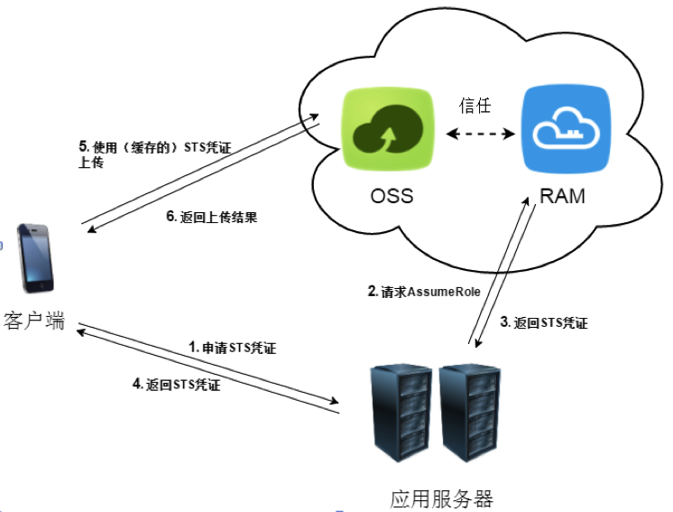

# [对象存储OSS](https://help.aliyun.com/product/31815.html?spm=5176.750001.2.8.VvmghX)

阿里云对象存储服务（Object Storage Service，简称 OSS），是阿里云提供的海量、安全、低成本、高可靠的云存储服务。

## [开始使用阿里云 OSS](https://help.aliyun.com/document_detail/31883.html?spm=5176.product31815.3.1.IqC0ie)

1. 开通OSS服务
1. 创建存储空间
1. 上传文件
1. 分享文件
1. 删除文件
1. 删除存储空间

## [开发人员指南](https://help.aliyun.com/document_detail/31827.html?spm=5176.doc31827.3.2.b2ViA1)

### OSS 术语表

英文 | 中文
--- | ---
Bucket | 存储空间
Object | 对象或者文件
Endpoint | OSS 访问域名
Region | 地域或者数据中心
AccessKey | AccessKeyId 和 AccessKeySecret 的统称，访问密钥
Put Object | 简单上传
Post Object | 表单上传
Multipart Upload | 分片上传
Append Object | 追加上传
Get Object | 简单下载
Callback | 回调
Object Meta | 文件元信息。用来描述文件信息，例如长度、类型等
Data | 文件数据
Key | 文件名
ACL （Access Control List） | 存储空间或者文件的权限

### 基于 OSS 的移动开发

#### 开发架构图

典型的基于OSS的移动开发有四个组件：

* OSS：提供上传、下载、上传回调等功能。
* 开发者的移动客户端（App或者网页应用），简称客户端：通过开发者提供的服务，间接使用OSS。
* 应用服务器：客户端交互的服务器。也是开发者的业务服务器。
* 阿里云STS：颁发临时凭证。

#### 开发业务流程

## [权限管理概述](https://help.aliyun.com/document_detail/31929.html)

阿里云权限管理机制包括访问控制（Resource Access Management，简称 RAM）和安全凭证管理（Security Token Service，简称 STS），可以根据需求使用不同权限的子账号来访问OSS，也支持为用户提供访问的临时授权。灵活使用RAM和STS能极大的提高管理的灵活性和安全性。

* RAM和STS介绍
* 不使用主账号访问OSS
* 读写分离
* Bucket权限隔离
* [使用STS的临时凭证来访问OSS](https://help.aliyun.com/document_detail/31935.html)
