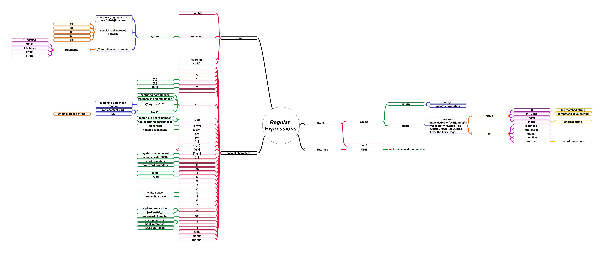

# Regular Expression

正则表达式在格式化字符串，格式检测等方面用途广泛，下面是一些常用案例代码。

## 格式化字符串

比如，需要将 `3b2deaccace043098b1e82648f7d36d5` 格式化为 `3b2deacc-ace0-4309-8b1e-82648f7d36d5`:

```javascript
function format(str) {
    const regexp = /(\w{8})(\w{4})(\w{4})(\w{4})(\w{12})/;
    return str.replace(regexp, function(match, p1, p2, p3, p4, p5){
        return [p1, p2, p3, p4, p5].join('-');
    });
}

const raw = '3b2deaccace043098b1e82648f7d36d5';
const result = format(raw);
console.assert(result === '3b2deacc-ace0-4309-8b1e-82648f7d36d5', 'WRONG Format!');
```

## JavaScript 中正则表达式相关函数



## 参考文献
1. [String.prototype.replace() - JavaScript | MDN](https://developer.mozilla.org/en-US/docs/Web/JavaScript/Reference/Global_Objects/String/replace)